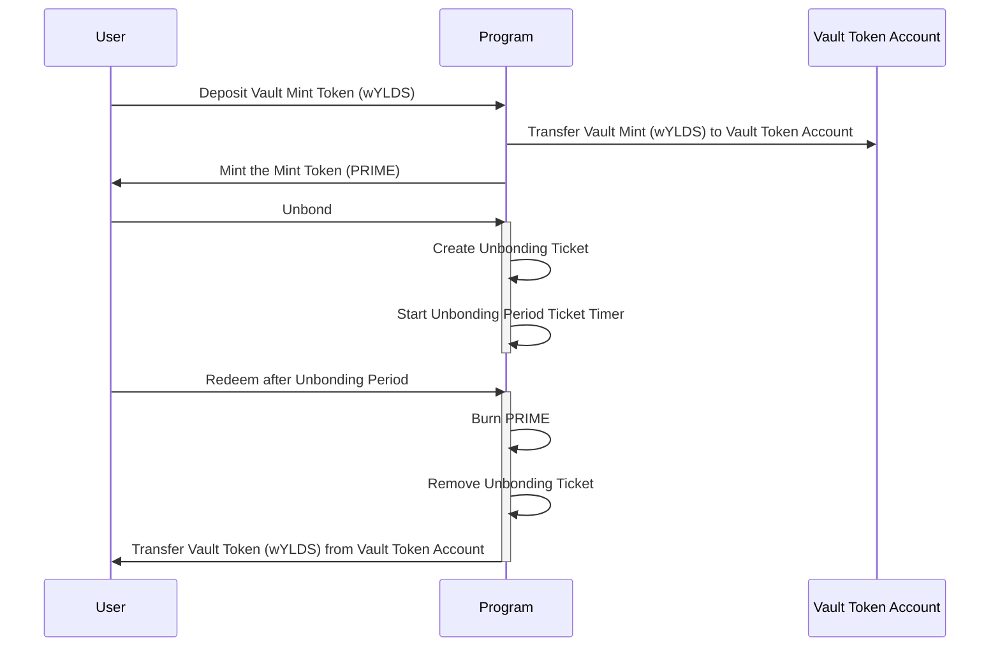

# Hastra Vault/Mint/Stake Protocol on Solana

This Solana program implements a **vault-based liquid staking protocol** that allows users to stake vault tokens (like wYLDS) and receive tradeable liquid staking tokens (like PRIME) in return.

## Core Architecture

**Staking Mechanism:**
- Users deposit vault tokens into a program-controlled vault
- Program mints equivalent liquid staking tokens that maintain 1:1 parity
- Users can trade/transfer liquid tokens while maintaining their staking position

**Unstaking Process:**
- Two-phase withdrawal: `unbond()` initiates waiting period, `redeem()` completes withdrawal
- Configurable unbonding period prevents instant liquidity (governance security)
- Users burn staking tokens to retrieve original vault tokens

The **rewards process** in this Solana liquid staking protocol involves off-chain yield generation and on-chain distribution via merkle trees.

## Off-Chain Yield Generation Process

**Yield Generation Flow:**
1. Vault tokens (wYLDS) deposited by users sit in the program-controlled vault
2. Authorized business entities use vault tokens for external investment
3. Vault tokens deployed into high-yield DeFi protocols, lending markets, or other investment vehicles
4. Yield generated from these external positions accumulates off-chain
5. Business process calculates each user's pro-rata share based on their staking token holdings and duration

## On-Chain Rewards Distribution

Rewards are distributed on-chain using a merkle tree-based claim system to ensure efficiency and security. The program is initialized with a list of reward administrators who can post new reward epochs. Each reward epoch contains a merkle root summarizing user rewards for that period.

**Epoch-Based System:**
- Rewards are distributed in discrete epochs (e.g., weekly)
- Each epoch has a unique index and merkle root representing user rewards
- Epoch duration and timing are configurable by program administrators
- Users can only claim rewards for past epochs, not the current one
- Epochs are immutable once created to ensure integrity
- Administrators can create epochs with a merkle root summarizing user rewards
- Users claim rewards by providing a merkle proof against the stored root
- Rewards are minted as additional staking tokens (PRIME).

**Merkle Tree Structure:**
- **Leaf Node**: `sha256(user_pubkey || reward_amount_le_bytes || epoch_index_le_bytes)`
- **Tree Construction**: All user rewards for an epoch are hashed and organized into a sorted binary merkle tree
- **Root**: Final merkle root represents the entire reward distribution for that epoch

**Administrative Posting Process:**

1. Authorized reward admin computes user rewards off-chain
2. Constructs merkle tree and computes root
3. Calls `create_rewards_epoch()` with epoch index, merkle root, and total rewards:

```rust
pub fn create_rewards_epoch(
    ctx: Context<CreateRewardsEpoch>,
    index: u64,           // Epoch identifier  
    merkle_root: [u8; 32], // Computed merkle root
    total: u64,           // Total rewards for verification
) -> Result<()>
```

## User Claim Process
Users claim their rewards by providing their allocated amount and a merkle proof. The program verifies the proof against the stored merkle root for the specified epoch.

**Merkle Proof Verification:**
1. User provides their allocated `amount` and merkle `proof` (array of sibling hashes)
2. Program reconstructs leaf: `sha256(user || amount || epoch_index)`
3. Program walks up the tree using proof siblings with sorted pair hashing
4. Final computed root must match the stored epoch merkle root

```rust
pub fn claim_rewards(
    ctx: Context<ClaimRewards>, 
    amount: u64, 
    proof: Vec<[u8; 32]>
) -> Result<()>
```

## Double-Claim Prevention

**Claim Record System:**
- Each successful claim creates a `ClaimRecord` PDA with seeds: `[b"claim", epoch.key(), user.key()]`
- Account creation constraint prevents duplicate claims:
  ```rust
  #[account(
      init,  // Fails if account already exists
      payer = user,
      space = ClaimRecord::LEN,
      seeds = [b"claim", epoch.key().as_ref(), user.key().as_ref()],
      bump
  )]
  pub claim_record: Account<'info, ClaimRecord>,
  ```

**Security Benefits:**
- **Immutable Claims**: Once created, ClaimRecord cannot be deleted or modified
- **Epoch Isolation**: Each epoch has separate claim records, preventing cross-epoch issues
- **User Isolation**: Each user has individual claim records per epoch
- **Rent Recovery**: Claim records are permanent (no close instruction), ensuring claim history preservation

This design ensures that yield generated from rehypothecated vault tokens is fairly distributed to staking token holders while preventing any possibility of double-claiming rewards.

## Administrative Features

**Freeze System:**
- Designated administrators can freeze/thaw specific token accounts
- Useful for compliance, security incidents, or regulatory requirements
- Maximum 5 freeze administrators with program update authority control

**Rewards Distribution:**
- Merkle tree-based reward claims for staking incentives
- Epoch-based system with configurable reward periods
- Prevents double-claiming with permanent claim records
- Rewards minted as additional staking tokens

## Security Model

**Program-Controlled Assets:**
- Vault authority PDA controls all deposited tokens
- Mint authority PDA controls staking token issuance
- Freeze authority PDA manages account freezing capabilities

**Administrative Controls:**
- Program upgrade authority can modify configurations
- Separate administrator lists for freeze and rewards functions
- All sensitive operations require proper authority validation

**Account Structure:**
- `Config`: Program settings and administrator lists
- `UnbondingTicket`: Tracks user withdrawal requests with timestamps
- `RewardsEpoch`: Manages reward distribution with merkle proofs
- `ClaimRecord`: Prevents reward double-spending

This creates a secure, flexible liquid staking solution suitable for DeFi protocols requiring both liquidity and governance controls.

There are several different aspects to this repo, but all are related to the Vault/Mint/Stake program. We use rust (for the solana program), typescript (helpers that use the solana and anchor libs), and resource files (configurations, images, etc... that assist in setting everything up).

Based on the repository structure and code files, here's a **Project Layout** section for your README:

## Project Layout

```
hastra-sol-vault-stake/
├── programs/
│   └── hastra-sol-vault-stake/
│       └── src/
│           ├── lib.rs                    # Main program entry point
│           ├── account_structs.rs        # Anchor account validation structs
│           ├── processor.rs              # Core business logic implementation
│           ├── state.rs                  # Program data structures (Config, UnbondingTicket, etc.)
│           ├── error.rs                  # Custom error definitions
│           └── guard.rs                  # Authorization validators
├── scripts/
│   ├── config.sh                        # Interactive deployment & management script
│   ├── deposit.ts                       # Stake vault tokens for liquid tokens
│   ├── unbond.ts                        # Initiate unstaking process
│   ├── redeem.ts                        # Complete withdrawal after unbonding period
│   ├── update_config.ts                 # Modify program configuration
│   ├── update_mint_authority.ts         # Change mint authority ownership
│   ├── update_freeze_administrators.ts  # Manage freeze administrator list
│   ├── initialize.ts                    # Deploy and initialize program
│   └── register_meta.ts                 # Setup Metaplex token metadata
├── target/
│   ├── deploy/                          # Compiled program binaries
│   ├── idl/                            # Generated Interface Definition Language files
│   └── types/                          # TypeScript type definitions
├── tests/                              # Anchor test suite
├── Anchor.toml                         # Anchor framework configuration
├── Cargo.toml                          # Rust dependencies and workspace
└── package.json                        # Node.js dependencies for TypeScript scripts
```

### Core Components

**Rust Program** (`programs/hastra-sol-vault-stake/src/`):
- **State Management**: Account structures and program data models
- **Business Logic**: Staking, unstaking, rewards, and administrative functions
- **Security Layer**: Authorization guards and error handling

**TypeScript Scripts** (`scripts/`):
- **Deployment Tools**: Automated setup and configuration management
- **User Operations**: Deposit, unbond, redeem, and claim workflows
- **Admin Functions**: Program updates and authority management

**Generated Assets** (`target/`):
- **Program Binary**: Deployable Solana bytecode
- **Type Definitions**: TypeScript interfaces for client integration
- **IDL Files**: JSON schema for cross-platform compatibility

This modular structure separates on-chain program logic from off-chain tooling while providing comprehensive deployment and management capabilities.

## Required Libs/Utils
Like all recent projects, we have to include a bunch of boiler plate libs/utils. We'll keep a running list here, but it is best to note that this project got started by reading the https://solana.com/docs/intro/installation doc.

**Prerequisites**
- yarn
- solana w/spl-token
- anchor cli (recommend using avm to manage anchor versions)
- rust

### Yarn
`yarn install` to install node js dependencies. Don't make the mistake I did, and try to use npm.

### Anchor

To build the project with anchor, we have to install rust. It is also best to ensure you have the latest version by running `rustup update` prior to engaging in development. Anchor follows the conventional command for building the Solana programs in this repo.
```bash
$ anchor build
```

> This section uses the `scripts/config.sh` script to execute commands with the correct environment variables set.
> You can also run the commands directly in your terminal, but ensure you set the `ANCHOR_PROVIDER_URL` and `ANCHOR_WALLET` environment variables correctly.
> Refer to the `config.sh` script for examples.


### Generate a new keypair

This section assumes a fresh rollout on devnet. If you already have a keypair you want to use, skip this step.

```bash
$ solana-keygen new --no-passphrase --force --outfile ~/.config/solana/hastra-devnet-id.json
Generating a new keypair
Wrote new keypair to /Users/jd/.config/solana/hastra-devnet-id.json
================================================================================
pubkey: GusaXhaH11VvYyFvsEiaaaBw3oFUjgmVoJZswzb9cnqc
================================================================================
Save this seed phrase to recover your new keypair:
refuse detail throw curtain spell journey grab shiver assume salute recycle tube
================================================================================
```

### Fresh Rollout of the Vault/Mint Program

#### Start ./scripts/config.sh

```
$ sh config.sh

Select Solana network (devnet, mainnet-beta, testnet) []: devnet

Current settings in devnet_vault.history:

Enter path to Solana wallet keypair [/Users/jd/.config/solana/hastra-devnet-id.json]:
Enter path to Solana wallet keypair [/Users/jd/.config/solana/hastra-devnet-id.json]:
Enter Vault Token Mint address (the token accepted for swap) []: VPaRhdpjLLCTcCFu23Awq6U5q9dzuhW2oQwP37J1Nxb

Config File: /Users/jd/.config/solana/cli/config.yml
RPC URL: https://api.devnet.solana.com
WebSocket URL: wss://api.devnet.solana.com/ (computed)
Keypair Path: /Users/jd/.config/solana/hastra-devnet-id.json
Commitment: confirmed

Public Key: HVghX7uoGJYCxbom5BHCVxPWSXzTcPFNRogmLhgvKML6 (3.50890496 SOL)
Program ID: AixEL5nihPVirtmPki2m1bS2a2eVeMY22hxyihYWXrBL

Select an action:
1) Build Program		             8) Show Current Settings
2) Deploy Program		             9) Update Unbonding Period
3) Initialize Program		        10) Update Freeze Authority
4) Setup Metaplex		            11) Create Mint Token
5) Set Mint and Freeze Authorities  12) Create Vault Token Account
6) Update Metaplex		            13) Reset and Set New Program ID
7) Show Accounts & PDAs		        14) Exit
#?
```

#### Choose option `11` Create Mint Token

This step creates a new mint token that will be minted when users deposit the vault token (e.g. wYLDS). When
the program is initialized, the mint authority will be set to a PDA owned by the program.

```
Creating Mint Token...
Mint Token: 7Ei9b4A5MqddAT5gtjW4frRXuwk2iNefU6NMUaqQraqg
```

#### Choose Option `12` Create Vault Token Account

This step creates the token account that will hold the vault tokens when users stake their mint tokens.
When the program is initialized, the vault authority PDA will be set as the owner of this token account.

```
Creating Vault Token Account (ATA)...
Vault Token Account: Dz4nct4PowiRpiKrUEShc3vyTKVaPLo8aKcFYYqrUgdq
```

#### Choose Option `4` to Setup Mint Token on Metaplex

Sets up the mint token on Metaplex. You will be prompted for the name, symbol, and metadata URL. Metaplex is used
to store the token metadata, including the image that will be displayed in wallets as well as the denomination and display
decimals.

```
Enter Metaplex Token Name []: PRIMEdev
Enter Metaplex Token Symbol []: PRIMEdev
Enter Metaplex Token Metadata URL (must be a valid JSON URL) []: https://storage.googleapis.com/hastra-cdn-prod/spl/primedevnet.meta.json
yarn run v1.22.19
$ /Users/jd/provenanceio/git/hastra-sol-vault-stake/node_modules/.bin/ts-node scripts/register_meta.ts --mint 7Ei9b4A5MqddAT5gtjW4frRXuwk2iNefU6NMUaqQraqg --keypair /Users/jd/.config/solana/hastra-devnet-id.json --name PRIMEdev --symbol PRIMEdev --token_meta_url https://storage.googleapis.com/hastra-cdn-prod/spl/primedevnet.meta.json
Using mint 7Ei9b4A5MqddAT5gtjW4frRXuwk2iNefU6NMUaqQraqg current key owner: HVghX7uoGJYCxbom5BHCVxPWSXzTcPFNRogmLhgvKML6
Using token name: PRIMEdev
Using token symbol: PRIMEdev
Using token meta_url: https://storage.googleapis.com/hastra-cdn-prod/spl/primedevnet.meta.json
Using Solana RPC: https://api.devnet.solana.com
Transaction Result: {"signature":{"0":71,"1":50,"2":150,"3":101,"4":39,"5":139,"6":224,"7":224,"8":164,"9":69,"10":185,"11":82,"12":139,"13":253,"14":161,"15":141,"16":107,"17":35,"18":6,"19":119,"20":172,"21":130,"22":159,"23":90,"24":27,"25":207,"26":41,"27":122,"28":249,"29":247,"30":195,"31":253,"32":173,"33":41,"34":65,"35":88,"36":230,"37":63,"38":39,"39":73,"40":82,"41":90,"42":119,"43":166,"44":164,"45":117,"46":227,"47":196,"48":107,"49":119,"50":236,"51":59,"52":64,"53":118,"54":139,"55":134,"56":142,"57":184,"58":33,"59":251,"60":9,"61":200,"62":53,"63":4},"result":{"context":{"slot":412796819},"value":{"err":null}}}
✨  Done in 14.92s.
```

#### Choose Option `1` to Build Program

Now that the requisite tokens are created, we can build the program. This will also generate the IDL and typescript types
that are used by the scripts and can be used by other frontends.

> Be sure to set the location of any FEs that use the IDL and types. In this deployment, the `hastra-fi-nexus-flow` frontend
> is used, so we set the paths accordingly.

```
...snip...
    Finished `release` profile [optimized] target(s) in 0.51s
    Finished `test` profile [unoptimized + debuginfo] target(s) in 0.43s
     Running unittests src/lib.rs (/Users/jd/provenanceio/git/hastra-sol-vault-stake/target/debug/deps/hastra_sol_vault_stake-7ca5585766e0de87)

Enter destination for hastra_sol_vault_stake.ts TYPE [../../hastra-fi-nexus-flow/src/types/hastra-sol-vault-stake.ts]:
Enter destination for hastra_sol_vault_stake.ts IDL  [../../hastra-fi-nexus-flow/src/types/idl/hastra-sol-vault-stake.ts]:

Copied to ../../hastra-fi-nexus-flow/src/types/hastra-sol-vault-stake.ts
Copied to ../../hastra-fi-nexus-flow/src/types/idl/hastra-sol-vault-stake.ts

Config File: /Users/jd/.config/solana/cli/config.yml
RPC URL: https://api.devnet.solana.com
WebSocket URL: wss://api.devnet.solana.com/ (computed)
Keypair Path: /Users/jd/.config/solana/hastra-devnet-id.json
Commitment: confirmed

Public Key: HVghX7uoGJYCxbom5BHCVxPWSXzTcPFNRogmLhgvKML6 (3.49026848 SOL)
Program ID: 2uqPDoKh5RWUinnMTPyetaq2H24cr2BLi4frpUjQ92cD
```

#### Choose Option `2` to Deploy Program

When the program builds successfully, you can deploy it to the Solana cluster. This will upload the program binary and set the program ID.
The program ID, specific to your Solana ID, will be saved to the local anchor config as well as updated in the `lib.rs` file.

```
Deploying Program...
Getting Program ID...
Updated ../programs/hastra-sol-vault-stake/src/lib.rs with new Program ID dyXhxx6Y6LeMwZwb78oeTGWqwJkufPAMFEzH2QJ4mcp
Saving Deploy Keypair to local config /Users/jd/.config/solana
   Compiling hastra-sol-vault-stake v0.1.0 (/Users/jd/provenanceio/git/hastra-sol-vault-stake/programs/hastra-sol-vault-stake)
 ..snip...
Copied to ../../hastra-fi-nexus-flow/src/types/hastra-sol-vault-stake.ts
Copied to ../../hastra-fi-nexus-flow/src/types/idl/hastra-sol-vault-stake.ts
Program Id: dyXhxx6Y6LeMwZwb78oeTGWqwJkufPAMFEzH2QJ4mcp

Signature: zRjfMSdeRswn3qPPN6CgtdBx46WMwXwJDK3G75AE7ysSqBqATuTn2NQXj5f4A4yAdBdrnfEqNNAJJLwbQWrdew5

Program deployed with ID: dyXhxx6Y6LeMwZwb78oeTGWqwJkufPAMFEzH2QJ4mcp
```

### Choose Option `3` to Initialize Program

Now that the program is deployed, we can initialize it. This will set up the config account and set the various PDAs that the program will use to control the vault and mint tokens. You will be prompted for unbonding period, freeze administrators, and rewards administrators.

```
Enter comma-separated list of Freeze Administrator addresses []: GrzQ4vW3UviEDKN7aHGroayoJC3B87ovcSofyt2Q48KG,56NYkGD9TCijuYgfeiHTbMN9sqcr9uH2CeV1GnSCy4Xn
Enter comma-separated list of Rewards Administrator addresses []: GrzQ4vW3UviEDKN7aHGroayoJC3B87ovcSofyt2Q48KG,56NYkGD9TCijuYgfeiHTbMN9sqcr9uH2CeV1GnSCy4Xn
Enter Unbonding Period (in seconds) []: 120

Program ID: dyXhxx6Y6LeMwZwb78oeTGWqwJkufPAMFEzH2QJ4mcp
Vault (accepted token): VPaRhdpjLLCTcCFu23Awq6U5q9dzuhW2oQwP37J1Nxb
Mint (token to be minted): 7Ei9b4A5MqddAT5gtjW4frRXuwk2iNefU6NMUaqQraqg
Unbonding Period (seconds): <BN: 78>
Vault Token Account: Dz4nct4PowiRpiKrUEShc3vyTKVaPLo8aKcFYYqrUgdq
Config PDA: AwXPZz2r1AZRtZFF5hZYBkqknYgfWQ5yLfWNqnABNa63
Vault Authority PDA: 9Ee194o3nDNYHEwL2ZJnyw4iC56cEDqqDHefQm2vqmBW
Mint Authority PDA: 8f9TVEwWpUNFrUyqebszcapX7Sp6MQRACoAkf8EktorZ
Freeze Authority PDA: 6M6Vt7mpht37Dv3csrFqqpeF6UiexLazzxbFda7GzAE6
Freeze Administrators: [
  'GrzQ4vW3UviEDKN7aHGroayoJC3B87ovcSofyt2Q48KG',
  '56NYkGD9TCijuYgfeiHTbMN9sqcr9uH2CeV1GnSCy4Xn'
]
Rewards Administrators: [
  'GrzQ4vW3UviEDKN7aHGroayoJC3B87ovcSofyt2Q48KG',
  '56NYkGD9TCijuYgfeiHTbMN9sqcr9uH2CeV1GnSCy4Xn'
]
Transaction: 7EdoUS4ncKyZ4CHirWYwxx9yNYjND2eUo27ejcAVzZH4ohSWnSHsyyK9Cdme5txEccJJMUD2hqys58z7Be21kdZ
Done in 2.75s.
```

#### Choose Option `5` Set Mint and Freeze Authorities

This step sets the mint and freeze authorities to the PDAs created during initialization. This ensures that only the program can mint new tokens and freeze accounts holding the mint token.

```
Setting Mint Authority to 8f9TVEwWpUNFrUyqebszcapX7Sp6MQRACoAkf8EktorZ
Updating 7Ei9b4A5MqddAT5gtjW4frRXuwk2iNefU6NMUaqQraqg
  Current mint: HVghX7uoGJYCxbom5BHCVxPWSXzTcPFNRogmLhgvKML6
  New mint: 8f9TVEwWpUNFrUyqebszcapX7Sp6MQRACoAkf8EktorZ

Signature: vSkbYztvxJ3HqtnDD9c8M8afvF6BNUJZCF9mMJ9xbMDNYzZvZ4WGV5ZrEmheMJAP8D9xJNzSvQBrvJDR5PY8Yyx

Setting Freeze Authority to 6M6Vt7mpht37Dv3csrFqqpeF6UiexLazzxbFda7GzAE6
Updating 7Ei9b4A5MqddAT5gtjW4frRXuwk2iNefU6NMUaqQraqg
  Current freeze: HVghX7uoGJYCxbom5BHCVxPWSXzTcPFNRogmLhgvKML6
  New freeze: 6M6Vt7mpht37Dv3csrFqqpeF6UiexLazzxbFda7GzAE6

Signature: 4Y7SD8oTAy7twiXVoBbbXwmXVuGRhZXc16BuGsQQjqtw9Z9Qzb47fhgv6VU6ngCPaRjpRLBRGfnP2uvKpHdQWdgf
```

 
### Local Prerequisite Token Set Up

The program requires two tokens to operate. The tokens can be any SPL token, but typically the vault token is a stablecoin like wYLDS, and the mint token is a custom token that represents a claim on the vault tokens. There are token accounts for both the user and the program to hold the tokens.

To make it easier to understand the tokens in play, here's a sequence diagram on how the tokens interact.



### Accounts in Play

| Token/Account Type  | Symbol  | Description                                                  | Mint Authority                                                                                        | Freeze Authority            |
|---------------------|---------|--------------------------------------------------------------|-------------------------------------------------------------------------------------------------------|---------------------------------------|
| Vault Mint          | wYLDS   | The token the user deposits to receive the minted token (PRIME) | Your Solana Wallet (e.g. hastra-devnet-id.json) initially, then Program Derived Address (PDA) of the program | Your Solana Wallet (e.g. hastra-devnet-id.json) initially, then Program Derived Address (PDA) of the program |
| Mint Token          | PRIME   | The token that is minted when the user deposits the vault token (wYLDS) | Your Solana Wallet (e.g. hastra-devnet-id.json) initially, then Program Derived Address (PDA) of the program  | Your Solana Wallet (e.g. hastra-devnet-id.json) initially, then Program Derived Address (PDA) of the program |
| Vault Token Account | N/A     | The token account that will hold the vaulted tokens (e.g. wYLDS) when users deposit them in exchange for the minted token (e.g. PRIME). | Program Derived Address (PDA) of the program                                                          | N/A |

## Freeze and Thaw

The program uses a list of accounts that define the freeze and thaw administrators. These accounts can freeze and thaw user token accounts for the Mint Token (e.g. PRIME). This is useful in the event of a security issue or other situation where you need to prevent users from transferring their staking tokens.

> The Mint Token must be created with the `--enable-freeze` flag to allow freezing and thawing of accounts. The Mint Token must also have a freeze authority set to the PDA of the program. `config.sh` script has a helper function to set the mint and freeze authority to the PDA of the program that can be run after the program is deployed and initialized.

### Add Freeze/Thaw Admin(s)

Use a comma to separate multiple admin public keys. Up to 5 are allowed.

```bash
$ ANCHOR_PROVIDER_URL=https://api.devnet.solana.com \
    ANCHOR_WALLET=~/.config/solana/hastra-devnet-id.json
    yarn run ts-node scripts/add_freeze_thaw_admin.ts \
    --admin <FREEZE_THAW_ADMIN_PUBLIC_KEY> \
    --mint AVpS6aTBQyCFBA4jymYRWqDyL7ipurn24PZVdjbbWT3X
```

### Freeze a User Account

Put a freeze on an account's Mint Token (e.g. PRIME) account. This prevents the user from transferring their staking tokens.

```bash
$ ANCHOR_PROVIDER_URL=https://api.devnet.solana.com \
    ANCHOR_WALLET=~/.config/solana/hastra-devnet-id.json
    yarn run ts-node scripts/freeze_account.ts \
    --user_account <USER_STAKING_TOKEN_ACCOUNT_TO_FREEZE> \
    --mint AVpS6aTBQyCFBA4jymYRWqDyL7ipurn24PZVdjbbWT3X
```

### Thaw a User Account

Put a freeze on an account's Mint Token (e.g. PRIME) account. This prevents the user from transferring their staking tokens.

```bash
$ ANCHOR_PROVIDER_URL=https://api.devnet.solana.com \
    ANCHOR_WALLET=~/.config/solana/hastra-devnet-id.json
    yarn run ts-node scripts/thaw_account.ts \
    --user_account <USER_STAKING_TOKEN_ACCOUNT_TO_FREEZE> \
    --mint AVpS6aTBQyCFBA4jymYRWqDyL7ipurn24PZVdjbbWT3X
```
