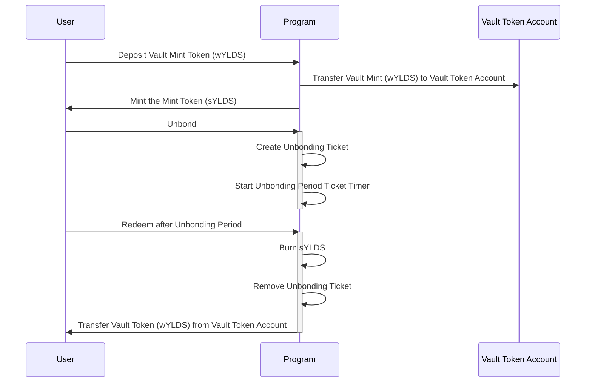

# Hastra Vault/Mint/Stake Protocol on Solana

This Solana program implements a **vault-based liquid staking protocol** that allows users to stake vault tokens (like wYLDS) and receive tradeable liquid staking tokens (like sYLDS) in return.

## Core Architecture

**Staking Mechanism:**
- Users deposit vault tokens into a program-controlled vault
- Program mints equivalent liquid staking tokens that maintain 1:1 parity
- Users can trade/transfer liquid tokens while maintaining their staking position

**Unstaking Process:**
- Two-phase withdrawal: `unbond()` initiates waiting period, `redeem()` completes withdrawal
- Configurable unbonding period prevents instant liquidity (governance security)
- Users burn staking tokens to retrieve original vault tokens

The **rewards process** in this Solana liquid staking protocol involves off-chain yield generation and on-chain distribution via merkle trees.

## Off-Chain Yield Generation Process

**Yield Generation Flow:**
1. Vault tokens (wYLDS) deposited by users sit in the program-controlled vault
2. Authorized business entities use vault tokens for external investment
3. Vault tokens deployed into high-yield DeFi protocols, lending markets, or other investment vehicles
4. Yield generated from these external positions accumulates off-chain
5. Business process calculates each user's pro-rata share based on their staking token holdings and duration

## On-Chain Rewards Distribution

Rewards are distributed on-chain using a merkle tree-based claim system to ensure efficiency and security. The program is initialized with a list of reward administrators who can post new reward epochs. Each reward epoch contains a merkle root summarizing user rewards for that period.

**Epoch-Based System:**
- Rewards are distributed in discrete epochs (e.g., weekly)
- Each epoch has a unique index and merkle root representing user rewards
- Epoch duration and timing are configurable by program administrators
- Users can only claim rewards for past epochs, not the current one
- Epochs are immutable once created to ensure integrity
- Administrators can create epochs with a merkle root summarizing user rewards
- Users claim rewards by providing a merkle proof against the stored root
- Rewards are minted as additional staking tokens (sYLDS).

**Merkle Tree Structure:**
- **Leaf Node**: `sha256(user_pubkey || reward_amount_le_bytes || epoch_index_le_bytes)`
- **Tree Construction**: All user rewards for an epoch are hashed and organized into a sorted binary merkle tree
- **Root**: Final merkle root represents the entire reward distribution for that epoch

**Administrative Posting Process:**

1. Authorized reward admin computes user rewards off-chain
2. Constructs merkle tree and computes root
3. Calls `create_rewards_epoch()` with epoch index, merkle root, and total rewards:

```rust
pub fn create_rewards_epoch(
    ctx: Context<CreateRewardsEpoch>,
    index: u64,           // Epoch identifier  
    merkle_root: [u8; 32], // Computed merkle root
    total: u64,           // Total rewards for verification
) -> Result<()>
```

## User Claim Process
Users claim their rewards by providing their allocated amount and a merkle proof. The program verifies the proof against the stored merkle root for the specified epoch.

**Merkle Proof Verification:**
1. User provides their allocated `amount` and merkle `proof` (array of sibling hashes)
2. Program reconstructs leaf: `sha256(user || amount || epoch_index)`
3. Program walks up the tree using proof siblings with sorted pair hashing
4. Final computed root must match the stored epoch merkle root

```rust
pub fn claim_rewards(
    ctx: Context<ClaimRewards>, 
    amount: u64, 
    proof: Vec<[u8; 32]>
) -> Result<()>
```

## Double-Claim Prevention

**Claim Record System:**
- Each successful claim creates a `ClaimRecord` PDA with seeds: `[b"claim", epoch.key(), user.key()]`
- Account creation constraint prevents duplicate claims:
  ```rust
  #[account(
      init,  // Fails if account already exists
      payer = user,
      space = ClaimRecord::LEN,
      seeds = [b"claim", epoch.key().as_ref(), user.key().as_ref()],
      bump
  )]
  pub claim_record: Account<'info, ClaimRecord>,
  ```

**Security Benefits:**
- **Immutable Claims**: Once created, ClaimRecord cannot be deleted or modified
- **Epoch Isolation**: Each epoch has separate claim records, preventing cross-epoch issues
- **User Isolation**: Each user has individual claim records per epoch
- **Rent Recovery**: Claim records are permanent (no close instruction), ensuring claim history preservation

This design ensures that yield generated from rehypothecated vault tokens is fairly distributed to staking token holders while preventing any possibility of double-claiming rewards.

## Administrative Features

**Freeze System:**
- Designated administrators can freeze/thaw specific token accounts
- Useful for compliance, security incidents, or regulatory requirements
- Maximum 5 freeze administrators with program update authority control

**Rewards Distribution:**
- Merkle tree-based reward claims for staking incentives
- Epoch-based system with configurable reward periods
- Prevents double-claiming with permanent claim records
- Rewards minted as additional staking tokens

## Security Model

**Program-Controlled Assets:**
- Vault authority PDA controls all deposited tokens
- Mint authority PDA controls staking token issuance
- Freeze authority PDA manages account freezing capabilities

**Administrative Controls:**
- Program upgrade authority can modify configurations
- Separate administrator lists for freeze and rewards functions
- All sensitive operations require proper authority validation

**Account Structure:**
- `Config`: Program settings and administrator lists
- `UnbondingTicket`: Tracks user withdrawal requests with timestamps
- `RewardsEpoch`: Manages reward distribution with merkle proofs
- `ClaimRecord`: Prevents reward double-spending

This creates a secure, flexible liquid staking solution suitable for DeFi protocols requiring both liquidity and governance controls.

There are several different aspects to this repo, but all are related to the Vault/Mint/Stake program. We use rust (for the solana program), typescript (helpers that use the solana and anchor libs), and resource files (configurations, images, etc... that assist in setting everything up).

Based on the repository structure and code files, here's a **Project Layout** section for your README:

## Project Layout

```
hastra-sol-vault-stake/
├── programs/
│   └── hastra-sol-vault-stake/
│       └── src/
│           ├── lib.rs                    # Main program entry point
│           ├── account_structs.rs        # Anchor account validation structs
│           ├── processor.rs              # Core business logic implementation
│           ├── state.rs                  # Program data structures (Config, UnbondingTicket, etc.)
│           ├── error.rs                  # Custom error definitions
│           └── guard.rs                  # Authorization validators
├── scripts/
│   ├── config.sh                        # Interactive deployment & management script
│   ├── deposit.ts                       # Stake vault tokens for liquid tokens
│   ├── unbond.ts                        # Initiate unstaking process
│   ├── redeem.ts                        # Complete withdrawal after unbonding period
│   ├── update_config.ts                 # Modify program configuration
│   ├── update_mint_authority.ts         # Change mint authority ownership
│   ├── update_freeze_administrators.ts  # Manage freeze administrator list
│   ├── initialize.ts                    # Deploy and initialize program
│   └── register_meta.ts                 # Setup Metaplex token metadata
├── target/
│   ├── deploy/                          # Compiled program binaries
│   ├── idl/                            # Generated Interface Definition Language files
│   └── types/                          # TypeScript type definitions
├── tests/                              # Anchor test suite
├── Anchor.toml                         # Anchor framework configuration
├── Cargo.toml                          # Rust dependencies and workspace
└── package.json                        # Node.js dependencies for TypeScript scripts
```

### Core Components

**Rust Program** (`programs/hastra-sol-vault-stake/src/`):
- **State Management**: Account structures and program data models
- **Business Logic**: Staking, unstaking, rewards, and administrative functions
- **Security Layer**: Authorization guards and error handling

**TypeScript Scripts** (`scripts/`):
- **Deployment Tools**: Automated setup and configuration management
- **User Operations**: Deposit, unbond, redeem, and claim workflows
- **Admin Functions**: Program updates and authority management

**Generated Assets** (`target/`):
- **Program Binary**: Deployable Solana bytecode
- **Type Definitions**: TypeScript interfaces for client integration
- **IDL Files**: JSON schema for cross-platform compatibility

This modular structure separates on-chain program logic from off-chain tooling while providing comprehensive deployment and management capabilities.

## Required Libs/Utils
Like all recent projects, we have to include a bunch of boiler plate libs/utils. We'll keep a running list here, but it is best to note that this project got started by reading the https://solana.com/docs/intro/installation doc.

**Prerequisites**
- yarn
- solana w/spl-token
- anchor cli (recommend using avm to manage anchor versions)
- rust

### Yarn
`yarn install` to install node js dependencies. Don't make the mistake I did, and try to use npm.

### Anchor

To build the project with anchor, we have to install rust. It is also best to ensure you have the latest version by running `rustup update` prior to engaging in development. Anchor follows the conventional command for building the Solana programs in this repo.
```bash
$ anchor build
```

## Build and Release

> Use the `scripts/config.sh` script to execute commands with the correct environment variables set.
 
### Local Prerequisite Token Set Up

Before deploying the program, there are several tokens that must be created. These are done using the spl-token cli. The commands below assume you have a solana wallet set up and configured to use devnet. You can use `solana config get` to see your current configuration.

For mainnet-beta, use `--url https://api.mainnet-beta.solana.com` and for testnet use `--url https://api.testnet.solana.com`. 

Ensure that your solana cli is configured to use the correct wallet that you want to be the upgrade authority of the program. You can use `solana config set --keypair ~/.config/solana/your-keypair.json` to set the keypair you want to use.

To make it easier to understand the tokens in play, here's a sequence diagram on how the tokens interact.



### Accounts in Play

| Token/Account Type  | Symbol  | Description                                                  | Mint Authority                                                                                        | Freeze Authority            |
|---------------------|---------|--------------------------------------------------------------|-------------------------------------------------------------------------------------------------------|---------------------------------------|
| Vault Mint          | wYLDS   | The token the user deposits to receive the minted token (sYLDS) | Your Solana Wallet (e.g. hastra-devnet-id.json) initially, then Program Derived Address (PDA) of the program | Your Solana Wallet (e.g. hastra-devnet-id.json) initially, then Program Derived Address (PDA) of the program |
| Mint Token          | sYLDS   | The token that is minted when the user deposits the vault token (wYLDS) | Your Solana Wallet (e.g. hastra-devnet-id.json) initially, then Program Derived Address (PDA) of the program  | Your Solana Wallet (e.g. hastra-devnet-id.json) initially, then Program Derived Address (PDA) of the program |
| Vault Token Account | N/A     | The token account that will hold the vaulted tokens (e.g. wYLDS) when users deposit them in exchange for the minted token (e.g. sYLDS). | Program Derived Address (PDA) of the program                                                          | N/A |

### Create the Tokens

> Note that the `--config` flag is optional if you have already set your solana config to use the correct wallet and network.

**Vault Mint**

e.g. wYLDS - the token the user deposits (vaults) to receive the mint token (sYLDS)

> NOTE: the `wYLDS` token should be created as part of the [wYLDS mint program creation process](https://github.com/provenance-io/sol-vault-mint). However, if you wish to create it manually, you can use the command below.

```bash
$ spl-token create-token --decimals 6 --enable-freeze \
  --url https://api.devnet.solana.com \
  --config ~/.config/solana/cli/devnet-config.yml
  
Creating token 8hbKALWTgf19Zy26frCZw7fKbSxpxJnTKUo67oANvDCb under program TokenkegQfeZyiNwAJbNbGKPFXCWuBvf9Ss623VQ5DA

Address:  8hbKALWTgf19Zy26frCZw7fKbSxpxJnTKUo67oANvDCb
Decimals:  6
```

**Mint Token**

e.g. sYLDS - the token that is minted when the user deposits the vault token (wYLDS)

```bash
$ spl-token create-token --decimals 6  --enable-freeze \
  --url https://api.devnet.solana.com \
  --config ~/.config/solana/cli/devnet-config.yml
  
Creating token AVpS6aTBQyCFBA4jymYRWqDyL7ipurn24PZVdjbbWT3X under program TokenkegQfeZyiNwAJbNbGKPFXCWuBvf9Ss623VQ5DA

Address:  AVpS6aTBQyCFBA4jymYRWqDyL7ipurn24PZVdjbbWT3X
Decimals:  6
```

**Vault Token Account**

The token account that will hold the vaulted tokens (e.g. wYLDS) when users deposit them in exchange for the minted token (e.g. sYLDS).

When the program has been initialized, the vault token account authority is set to the PDA of the program.

```bash
$ spl-token create-account 8hbKALWTgf19Zy26frCZw7fKbSxpxJnTKUo67oANvDCb \
            --owner ~/.config/solana/hastra-devnet-id.json \
            --url https://api.devnet.solana.com
                        
Creating account D3j4cPrzyhcFZTjZfG1zvioLbkH58Vnpbv3mBaYLVxfx
```

### Anchor Build
```bash
$ anchor build
```

### Deploy

> Use `api.solana.com` for mainnet, `api.devnet.solana.com` for devnet, and `api.testnet.solana.com` for testnet.

```bash
$ solana program deploy ./target/deploy/hastra_sol_vault_stake.so \
         --url https://api.devnet.solana.com \
         --upgrade-authority ~/.config/solana/hastra-devnet-id.json
         
Program ID: 6dbdnL74Nfc999jdHDP9uqBesriW6ewzoKP4s5eXdK7g         
```

### Metaplex

To get our FE, Solana Explorer, Phantom wallet, et al to recognize our token image, uri, etc. we have to submit our token info using the `umi` lib.

### CDN for Hastra Images/JSON

The `provenance-io` [Google Cloud Storage bucket](https://console.cloud.google.com/storage/browser/hastra-cdn-prod/spl;tab=objects?project=provenance-io) contains the metadata and images for the `*YLDS` tokens.

#### Pushing the data using umi

Use the `register_meta.ts` script to register the token metadata with Metaplex.

** Staking Mint **
```bash
$ ANCHOR_PROVIDER_URL=https://api.devnet.solana.com \
  ANCHOR_WALLET=~/.config/solana/hastra-devnet-id.json \
  yarn run ts-node scripts/register_meta.ts \
  --mint AVpS6aTBQyCFBA4jymYRWqDyL7ipurn24PZVdjbbWT3X \
  --keypair ~/.config/solana/hastra-devnet-id.json \
  --name "Hastra sYLDS Devnet" \
  --symbol sYLDSdev \
  --token_meta_url https://storage.googleapis.com/hastra-cdn-prod/spl/syldsdevnet.meta.json
```

> Tip: you can update the Metaplex info using the `--update` flag

### Initialize

This is where you get to set:
* Vault Token: the token that is accepted from the user in exchange for the minted token (e.g. wYLDS).
* Vault Token Account: The token account that will hold the vaulted tokens (e.g. wYLDS) when users deposit them in exchange for the minted token (e.g. sYLDS). This token account must be created prior to calling initialize (see above). The authority of this token account will be set to the PDA of the program at initialization time.
* Mint Token: the token that will be minted and transferred to the user the mint token (eg. sYLDS)
* Unbonding Period: The unbonding period (in seconds) defines how long a user must hold sYLDS, after requesting an unbond, before they can redeem it for the Vault Token (e.g. wYLDS). After the unbonding period has elapsed the user can call the redeem function to burn the staking token (sYLDS) and receive the vault token back (wYLDS).

```bash
$ ANCHOR_PROVIDER_URL=https://api.devnet.solana.com \
  ANCHOR_WALLET=~/.config/solana/hastra-devnet-id.json \
  yarn run ts-node scripts/initialize.ts \
  --vault 8hbKALWTgf19Zy26frCZw7fKbSxpxJnTKUo67oANvDCb \
  --vault_token_account D3j4cPrzyhcFZTjZfG1zvioLbkH58Vnpbv3mBaYLVxfx \
  --mint AVpS6aTBQyCFBA4jymYRWqDyL7ipurn24PZVdjbbWT3X \
  --unbonding_period 1814400
```

> IMPORTANT: After initialization, the mint authority of the Mint Token (e.g. sYLDS) must be set to the `Mint Authority PDA` output by the `initialize` script. THIS SHOULD BE DONE AFTER SETTING UP THE TOKEN IN METAPLEX.
 

## Setting the Staking Mint Authority

After initializing the program and registering the staking mint token with Metaplex, the mint authority of the Mint Token (e.g. sYLDS) must be set to the `Mint Authority PDA` output by the `initialize` script.

** Staking Mint **
```bash
$ spl-token authorize AVpS6aTBQyCFBA4jymYRWqDyL7ipurn24PZVdjbbWT3X mint 2DSeF8fQwj9F6DgF6MwmWoA3sTp9YVgxoboyKic3ZtAH \
      --url https://api.devnet.solana.com \
      --authority ~/.config/solana/hastra-devnet-id.json
      
Updating AVpS6aTBQyCFBA4jymYRWqDyL7ipurn24PZVdjbbWT3X
  Current mint: Aq9ykXqr1qizcSe8KkLZa6BJN37dDq95MyG9ZXPYnDTT
  New mint: 2DSeF8fQwj9F6DgF6MwmWoA3sTp9YVgxoboyKic3ZtAH
      
```

## Freeze and Thaw

The program uses a list of accounts that define the freeze and thaw administrators. These accounts can freeze and thaw user token accounts for the Mint Token (e.g. sYLDS). This is useful in the event of a security issue or other situation where you need to prevent users from transferring their staking tokens.

> The Mint Token must be created with the `--enable-freeze` flag to allow freezing and thawing of accounts. The Mint Token must also have a freeze authority set to the PDA of the program. `config.sh` script has a helper function to set the mint and freeze authority to the PDA of the program that can be run after the program is deployed and initialized.

### Add Freeze/Thaw Admin(s)

Use a comma to separate multiple admin public keys. Up to 5 are allowed.

```bash
$ ANCHOR_PROVIDER_URL=https://api.devnet.solana.com \
    ANCHOR_WALLET=~/.config/solana/hastra-devnet-id.json
    yarn run ts-node scripts/add_freeze_thaw_admin.ts \
    --admin <FREEZE_THAW_ADMIN_PUBLIC_KEY> \
    --mint AVpS6aTBQyCFBA4jymYRWqDyL7ipurn24PZVdjbbWT3X
```

### Freeze a User Account

Put a freeze on an account's Mint Token (e.g. sYLDS) account. This prevents the user from transferring their staking tokens.

```bash
$ ANCHOR_PROVIDER_URL=https://api.devnet.solana.com \
    ANCHOR_WALLET=~/.config/solana/hastra-devnet-id.json
    yarn run ts-node scripts/freeze_account.ts \
    --user_account <USER_STAKING_TOKEN_ACCOUNT_TO_FREEZE> \
    --mint AVpS6aTBQyCFBA4jymYRWqDyL7ipurn24PZVdjbbWT3X
```

### Thaw a User Account

Put a freeze on an account's Mint Token (e.g. sYLDS) account. This prevents the user from transferring their staking tokens.

```bash
$ ANCHOR_PROVIDER_URL=https://api.devnet.solana.com \
    ANCHOR_WALLET=~/.config/solana/hastra-devnet-id.json
    yarn run ts-node scripts/thaw_account.ts \
    --user_account <USER_STAKING_TOKEN_ACCOUNT_TO_FREEZE> \
    --mint AVpS6aTBQyCFBA4jymYRWqDyL7ipurn24PZVdjbbWT3X
```
